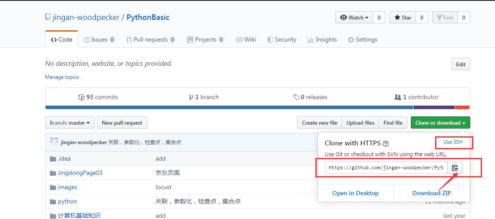

一、本地vscode拉取远程仓库到本地

1、到VSCode里新建一个文件夹;

2、组合键 Ctrl+` 呼出集成终端，或者点击——查看>点击集成终端 ;

3、在终端输入代码git clone  https://github.com/jingan-woodpecker/PythonBasic.git

4、等待克隆完成;

5、然后就可以写代码了;

二、本地vscode推送代码到远程仓库

1、切换到对应目录 cd PythonBasic

2、提交文件或文件夹：git add Github使用总结

3、命名提交的文件或文件夹：git commit -m "Github使用总结"

4、推送到远程仓库：git push -u origin master

三、markdown语法格式

[markdown语法格式](https://www.cnblogs.com/alantao/p/8521929.html)
