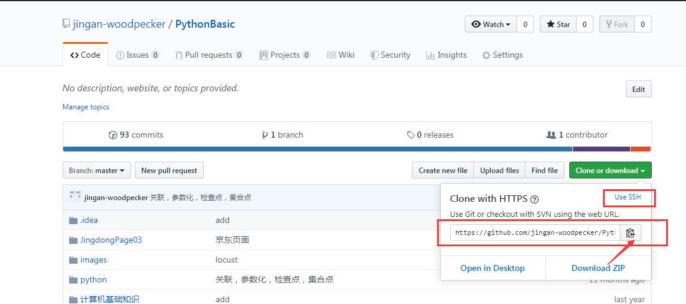

一、本地vscode拉取远程仓库到本地

1、到VSCode里新建一个文件夹;

2、组合键 Ctrl+` 呼出集成终端，或者点击——查看>点击集成终端 ;

3、在终端输入代码git clone  https://github.com/jingan-woodpecker/PythonBasic.git

4、等待克隆完成;

5、然后就可以写代码了;

二、本地vscode推送代码到远程仓库

1、切换到对应目录 cd PythonBasic

2、先用 git status 看你更改了哪些文件；

3、然后 git add 你想要提交的更改的文件 或者 git add . 所有的文件；

4、再git commit -m ‘提交信息’；

5、最后 git push origin master/你的分支 。

三、markdown语法格式

[markdown语法格式](https://www.cnblogs.com/alantao/p/8521929.html)
