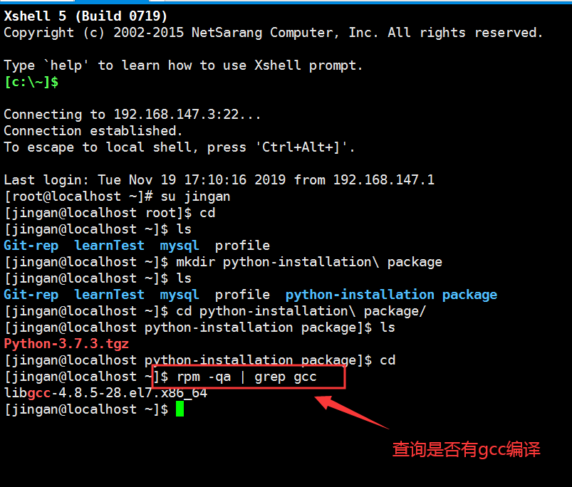
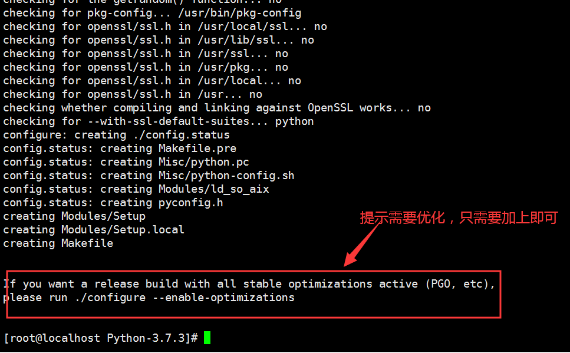

一、【拓展】如何用linux命令创建文件或者文件夹的名称时带上空格

	输入命令时加入“\”和空格即可，例如：touch 00-install\ python.md

二、python源码安装步骤

	（1）下载python源码安装包

	（2）查看源码：看看源码是什么语言，识别是什么计算机语言，为下面编译环境做准备

	（3）准备编译环境（python需要C语言的编译环境，所以需要gcc编译器）

			首先输入命令查询是否存在gcc编译器：rpm -qa | grep gcc

		
			不存在则安装：yum install gcc （如果是C++源码，则还需要安装gcc-c++软件包）

			yum搜索Pyhon只有python2版本的，所以需要官网下载python3包进行安装,命令yum info python 可查询软件包信息

	（4）检查【依赖、兼容】，预编译

		先用命令解压安装包:tar -zxvf Python-3.7.3.tgz

		进入到解压后的文件中，其中绿色的就是可执行文件,可用命令"ll"查看是否有执行权限,其中configure文件就是预编译的程序,要在当前目录下执行这个文件,输入命令:./configure（一般不会这样预编译）,需要指定安装目录

	输入命令:./configure --prefix=/usr/python-3.7.3  （一般第三方软件包都指定安装到usr目录下）检查完成后说明,预编译完成

	（5）编译

	（6）安装
