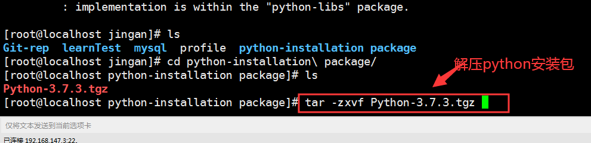
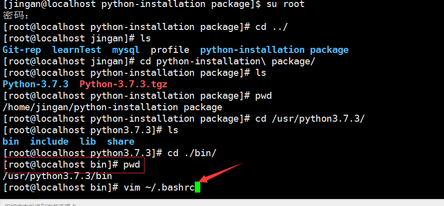

一、【拓展】如何用linux命令创建文件或者文件夹的名称时带上空格

	输入命令时加入“\”和空格即可，例如：touch 00-install\ python.md

二、python源码安装步骤

	（1）下载python源码安装包

	（2）查看源码：看看源码是什么语言，识别是什么计算机语言，为下面编译环境做准备

	（3）准备编译环境（python需要C语言的编译环境，所以需要gcc编译器）

		首先输入命令查询是否存在gcc编译器：rpm -qa | grep gcc

		
	不存在则安装：yum install gcc （如果是C++源码，则还需要安装gcc-c++软件包）

	yum搜索Pyhon只有python2版本的，所以需要官网下载python3包进行安装,命令yum info python 可查询软件包信息

	（4）检查【依赖、兼容】，预编译

		先用命令解压安装包:tar -zxvf Python-3.7.3.tgz

	进入到解压后的文件中，其中绿色的就是可执行文件,可用命令"ll"查看是否有执行权限,其中configure文件就是预编译的程序,
	要在当前目录下执行这个文件,输入命令:./configure（一般不会这样预编译）,需要指定安装目录

	输入命令:./configure --prefix=/usr/python-3.7.3  （一般第三方软件包都指定安装到usr目录下）检查完成后说明,预编译完成

安装python的pip包

	因为pip包需要依赖zlib，openssl这两个包，所以需要先安装
	可以输入命令安装:yum install zlib* openssl*  （加个符号*是表示匹配只要前面是zlib，openssl的依赖包都安装）

	再次进入Python-3.7.3，进行预编译输入命令: ./configure --prefix=/usr/python-3.7.3

启动下面图片提示的“优化项” --enable-optimizations

	输入命令再次预编译: ./configure --prefix=/usr/python-3.7.3 --enable-optimizations

	以上操作完成，则说明预编译完成

	（5）编译

	编译的命令是固定的，输入命令：make   回车即可等待十分钟左右(编译过程出现error则会编译终止)

	（6）安装

	输入安装命令：make install

	执行上述命令后报错（python3.7才会有），需要先用yum 安装libffi0-devel 再重新输入命令：make install

	可以切换目录到： /usr/python-3.7.3 查看是否有安装成功,现在下载的源码文件就可以删除了(就是当时解压出来的文件)

	启动python时要区分好文件，是在usr/python-3.7.3/bin/python3目录中去启动，这里一般是放下载的第三方软件包，不是源码包

	（7）配置环境变量

	PATH：配置的目的——让系统自动找到命令执行的文件路径
	path值：一堆目录，每个目录之间用冒号隔开。 

	复制好bin目录的路径：比如——/usr/python3.7.3/bin
	然后进入 vim ~/.bashrc

