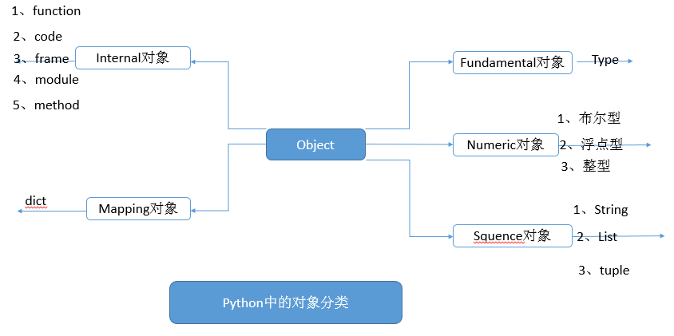

1、变量

    三要素： 变量名、变量值、变量类型(python中不需要特意声明变量类型)
    
    例如： a=1
    变量的值(1)都是存放到“堆内存”中的，变量名(a)是引用的意思即指向堆内存的内存地址，当要访问a的时候就会指向堆内存中所对应的值。
 
2、变量的类型

3、空值(变量不赋值则为空)

    空值是python里一个特殊的值，用None表示，None不能理解为0，因为0是有意义的，而None是一个特殊的空值。
    
4、简单类型

    包括数值类型+字符串
    数值(Numberic)类型包括：1、布尔型；2、浮点型；3、整型
    
    注意：布尔值的"True","False"的首字母都是大写的
    可以使用type(变量的名字)来查看变量的类型
       