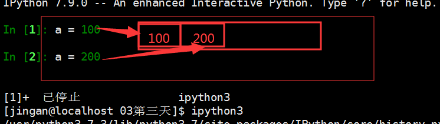
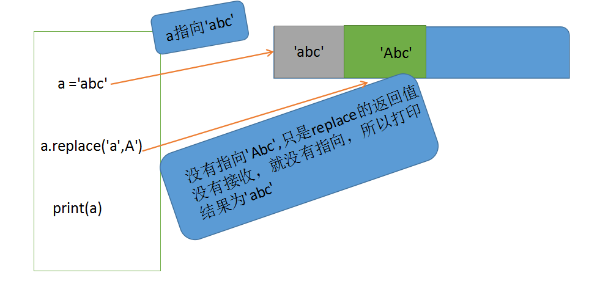
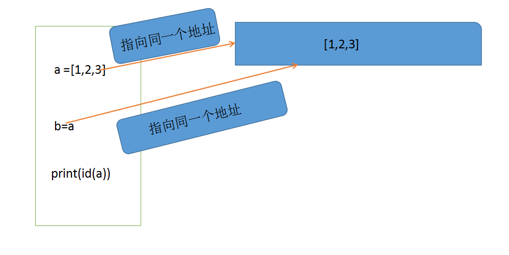

1、可变类型和不可变类型
	
可变类型：列表、字典
不可变类型：数值、字符串、元组

	可变和不可变指的是：值是不是可以变化的
	只要内存中定义了一个变量，就会有对应的内存地址存放

```python
'''例如定义一个值a=100，占用一个字节（一个字节占255，两个字节就是255*255）
字节不会说占用3个字节，数值类型要么占用2个、要么4个、8个，面向对象语言都是这样的
python中整数是不限制大小的，而java中整数是限制大小的'''

a = 100 #这个100就存在一个字节当中不能改了
a = 200 #变量a是改了，但是这个a的引用指向是改变了，指向了另一个内存地址

'''原先的a = 100没有被引用的时候，会被python进程回收，python是高级语言，不用管内存的释放和申请
所以是引用变了不是值变了，数值类型就是不可变类型'''
```


字符串也是不可变类型

	一个字符串定义好之后就不可以变化了，虽然字符串之间可以相加，但这个是得到一个新的字符串
```python
a = "123"
b = "abc"
c = a + b
#c得出来的是一个新的字符串，原来的空间中a和b内存地址还在，只是找了个新的地址
```

```python
#不可变类型的值是不可变的
a = "abc"
print(id(a))
a.replace("a","A")
print(id(a))

print(a)

#上面的修改只有用一个值接收(比如：b=a.replace("a","A")打印b结果才是"Abc",打印a还是原来的结果
'''
打印结果如下：  
30891232
30891232
abc
'''
```


```python
a = [1, 3, 4]
b = a
print(id(a))
print(id(b))

b += [5, 7]

print(a)
print(b)
"""
打印结果如下：
39367240
39367240

[1, 3, 4, 5, 7]
[1, 3, 4, 5, 7]

可变类型列表，经过b += [5, 7]修改后，只是改变了内容，指向是不变的即内存地址、id是不变的。
当只是b添加了列表[5, 7]后，a也会同时增加列表[5, 7]

#注意:如果是b = b+[5, 7]会先计算b+[5,7]生成一个新的列表，b就会指向一个新的地址，这时a还是等于[1,3,4]
#针对不可变类型a+=a <> a= a+b
"""
```


```python
a = [1, 4, 5]
print(id(a))

a = [1, 4, 5]
print(id(a))

"""
打印结果如下:
39432776
39434824

可变类型如果重新赋值，它的指向也会改变，即内存地址、id是会改变的
"""

```

2、字典：dict全称dictionary，在其他语言中也称为map，

    使用键-值（key-value）存储，缺一不可，具有极快的查找速度
    特点：键是不允许重复的；值可以重复，字典没有顺序，所以没有下标的概念。
    
    * 通过键访问字典的方式，如果访问的键不存在会报错，使用get()方法就不会报错
	因为字典是无序的，所以没有下标，不能通过下标来访问
    
```python
student = {"name":"zhangsan" , "age": 23 , "sex":"男"}
print(student["age"])

print(student.get("dddd"))#查询不存在的键，使用get函数，返回None
```

3、字典的常见操作

    * 新增元素
    
```python
student = {"name":"zhangsan" , "age": 23 , "sex":"男"}
student["address"]="guangdong"
print(student)
```

    * 查找元素(in not): 注意是判断一个键是否在字典中
    
```python
student = {"name":"zhangsan" , "age": 23 , "sex":"男"}
print("sex" in student)
```

    * 删除元素(del): 可以根据键删除,使用clear内存不回收
    
```python
student = {"name":"zhangsan" , "age": 23 , "sex":"男"}
del student["name"]
```
	* 修改元素，当输入的键是一样的时候，值不同就会覆盖原有的值，达到修改的目的

```python
student = ["zhangsan" , 23 , "男"]
student01 = ("小竹" , 20 , "女")

i = 0
#第一种迭代，显示序号
print("序号\t学生信息")
for stu in student:
    i += 1
    print("%s\t%s"%(i , student))

print("="*30)
#第二种枚举法
for st , item in enumerate(student01 , 1):
    print("%s\t%s" % (st , item))
```

3、字典中常见函数
    
    * len() 测量键值对的个数
    * keys() 返回一个包含字典所有key的列表:主要用来查询看键然后判断，新插入的键会不会重复
    
```python
student = {"name":"zhangsan" , "age": 23 , "sex":"男"}
print(student.keys())
```
    * values() 返回一个包含字典所有value的列表
    
```python
student = {"name":"zhangsan" , "age": 23 , "sex":"男"}
print(student.values())
```

    * 打印key和value
```python
student = {"name":"zhangsan" , "age": 23 , "sex":"男"}
for item in student.items():
    print("key为%s,value为%s"%item)#item其实就是元组，包含两个值
    
'''
key为name,value为zhangsan
key为age,value为23
key为sex,value为男
'''
```

```python
print("*"*30)
print("学生名字管理系统".center(50))
print("输入1：添加学生")
print("输入2：查找学生")
print("输入3：修改学生")
print("输入4：删除学生")
print("输入5：查看所有学生")
print("输入6：退出")

stus = []
while True:
    operate = input("请输入你想要进行的操作:")
    if operate == "1":
        name = input("请输入添加的学生姓名:")
        age = int(input("请输入添加的学生年龄:"))
        sex = input("请输入添加的学生性别:")
        #用字典存放每个学生的所有信息
        stu = {}
        stu["name"] = name
        stu["age"] = age
        stu["sex"] = sex
        #将所有学生信息都添加到列表中
        stus.append(stu)
    if operate == "2":
        name = input("请输入要查找的学生姓名:")
        for item in stus:
            if item["name"] == name:
                print("%s\t%s\t%s\t"%(item["name"],item["age"],item["sex"]))
                break  #整个循环终止
        else: #注意这个eles的位置，考虑清楚逻辑错误和语法错误
            print("该学生未找到")
    if operate == "3":
        pass
    if operate == "4":
        pass
    if operate == "5":
        print("序号\t姓名\t年龄\t性别")
        for i,item in enumerate(stus,1):
            print("%s\t%s\t%s\t%s\t"%(i,item["name"],item["age"],item["sex"]))
    if operate == "6":
        break
```

内置函数

    cmp(item1,item2)     比较两个值 -----相等返回0，小于为-1，大于为1
        在比较字典的时候，先比较键，再比较值；字符串比较ASCII值
    max(item)            返回最大值
    min(item)            返回最小值
    del(item)            删除变量

练习

	* 编程实现对一个元素全为数字的列表，求最大值，最小值

	* 统计字符串中，各个字符的个数

	* 完成一个路径的组装，先提示用户多次输入路径，最后显示一个完整的路径，比如/home/python/abc/etc-


