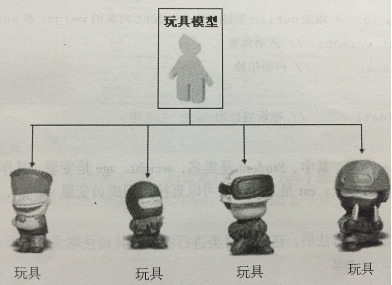

面向对象编程介绍

    面向过程：根据业务逻辑从上到下写代码
    面向对象：将数据与函数绑定到一起，进行封装，这样能够更快速的开发程序，减少了重复代码的重写过程
    
1）解决菜鸟买电脑的故事

    第一种方式:

    1)在网上查找资料

    2)根据自己预算和需求定电脑的型号 MacBook 15 顶配 1W8

    3)去市场找到苹果店各种店无法甄别真假 随便找了一家

    4)找到业务员,业务员推荐了另外一款 配置更高价格便宜,也是苹果系统的 1W

    5)砍价30分钟 付款9999

    6)成交

    回去之后发现各种问题

    第二种方式 :

    1)找一个靠谱的电脑高手

    2)给钱交易

面向对象和面向过程都是解决问题的一种思路而已

    买电脑的第一种方式:
        强调的是步骤、过程、每一步都是自己亲自去实现的
        这种解决问题的思路我们就叫做面向过程

    买电脑的第二种方式:
        强调的是电脑高手, 电脑高手是处理这件事的主角,对我们而言,我们并不必亲自实现整个步骤只需要调用电脑高手就可以解决问题
        这种解决问题的思路就 是面向对象

    用面向对象的思维解决问题的重点
        当遇到一个需求的时候不用自己去实现，如果自己一步步实现那就是面向过程
        应该找一个专门做这个事的人来做
        面向对象是基于面向过程的
        
总结：

    面向过程是一件事"该怎么做"，面向对象是一件事"该让谁来做",然后那个"谁"就是对象，
    它要怎么做是它的事，反正最后一群对象合力把一件事做成。
    
    面向过程： 我(吃)饭
    面向对象： (我)吃(饭)

2、类和对象

    对象是面向对象编程的核心，在使用对象的过程中，为了将具有共同特征和行为的一组对象抽象定义，提出了另外一个新的概念——类
    
    类就相当于制造飞机时的图纸，用它来进行创建的飞机就相当于对象
    
类

    人以类聚 物以群分。
    具有相似内部状态和运动规律的实体的集合(或统称为抽象)。 
    具有相同属性和行为事物的统称
    
    类是抽象的,在使用的时候通常会找到这个类的一个具体的存在,使用这个具体的存在。一个类可以找到多个对象
    
对象

    某一个具体事物的存在 ,在现实世界中可以是看得见摸得着的。

    可以是直接使用的
    
3、类和对象之间的关系

    总结：类就是创建对象的模板
    
区分类和对象

    奔驰汽车 类
    奔驰smart 类 
    张三的那辆奔驰smart 对象
    
    狗 类
    大黄狗 类 
    李四家那只大黄狗 对象 
    
    水果 类
    苹果 类 
    红苹果 类 红富士苹果 类 
    我嘴里吃了一半的苹果 对象
    
4、类的构成

    类(Class) 由3个部分构成

    类的名称:类名
    类的属性:一组数据
    类的方法:允许对其进行操作的方法 (行为)
    
5、类的抽象

    如何把日常生活中的事物抽象成程序中的类?

    拥有相同(或者类似)属性和行为的对象都可以抽像出一个类

    方法:一般名词都是类(名词提炼法)
    
<1> 坦克发射3颗炮弹轰掉了2架飞机

    坦克--》可以抽象成 类
    炮弹--》可以抽象成类
    飞机-》可以抽象成类

<2> 小明在公车上牵着一条叼着热狗的狗

    小明--》 人类
    公车--》 交通工具类
    热狗--》 食物类
    狗--》 狗类

