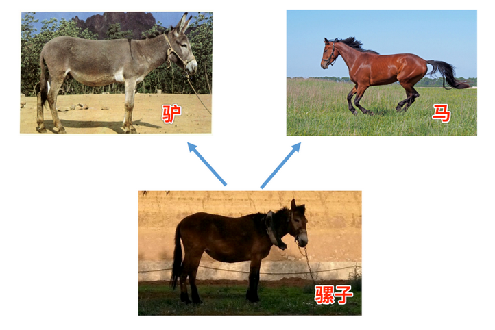

1、类的单继承

```python
class Animal():
    def __init__(self):
        print("动物的初始化")
        self.name="动物"

    def sleep(self):
        print("动物都会休息")

    def eat(self):
        print("所有动物都有觅食的能力")

class Dog(Animal):
    # def __init__(self):
    #     print("狗的初始化")

    def shout(self):
        print("汪汪汪")
#属性的继承，实际上也是方法的继承
#继承对象的属性本质上是因为调用了父类的init方法才继承了对象的共有属性
p1 = Dog()
p1.sleep()

'''
动物的初始化
动物都会休息
'''
```

    总结

    子类在继承的时候，在定义类时，小括号()中为父类的名字
    父类的属性、方法，会被继承给子类

2、多继承：即子类有多个父类，并且具有它们的特征



```python
#定义一个父类
class Animal():

    def sleep(self):
        print("动物都会休息")

    def eat(self):
        print("动物都有觅食的能力")
#定义一个父类
class Animal01():

    def run(self):
        print("动物都会行走")
#继承上面两个父类
class Bird(Animal , Animal01):

    def fly(self):
        print("鸟儿会飞行")

p1 = Bird()
p1.sleep()
p1.run()
p1.fly()
'''
动物都会休息
动物都会行走
鸟儿会飞行
'''
```

    说明

    python中是可以多继承的
    父类中的方法、属性，子类会继承

    多继承例子中，如果父类A和父类B中，有一个同名的方法，那么通过子类去调用的时候，看调用时括号中调用顺序
    
```python
class base(object):
    def test(self):
        print('----base test----')
class A(base):
    def test(self):
        print('----A test----')

# 定义一个父类
class B(base):
    def test(self):
        print('----B test----')

# 定义一个子类，继承自B、A调用顺序就是看括号中书写顺序
class C(B , A):
    pass


obj_C = C()
obj_C.test()

print(C.__mro__) #可以查看C类的对象搜索方法时的先后顺序
```

3、重写父类方法：所谓重写，就是子类中，有一个和父类相同名字的方法，在子类中的方法会覆盖掉父类中同名的方法

```python
class Cat(object):
    def sayHello(self):
        print("halou-----1")


class Bosi(Cat):

    def sayHello(self):
        print("halou-----2")

bosi = Bosi()

bosi.sayHello()
'''
halou-----2
'''
```

4、调用父类的方法:子类和父类有同样的方法，要想也调用父类的方法使用super().+方法

```python
class Person(object):
    def __init__(self):
        self.name = "小离"
        self.age = 22

class Guangdong_person(Person):
    #init和父类的init名字一样，所以叫方法的重写
    def __init__(self , set):
        super().__init__() #因为自身有init方法，如果要调用父类的init方法，就用super
        self.set = set

    def eat(self):
        print("广东人吃福建人")

p1 = Guangdong_person("女")
#调用了父类init的方法
print(p1.name)
print(p1.age)
p1.eat()
'''
小离
22
广东人吃福建人
'''
```
