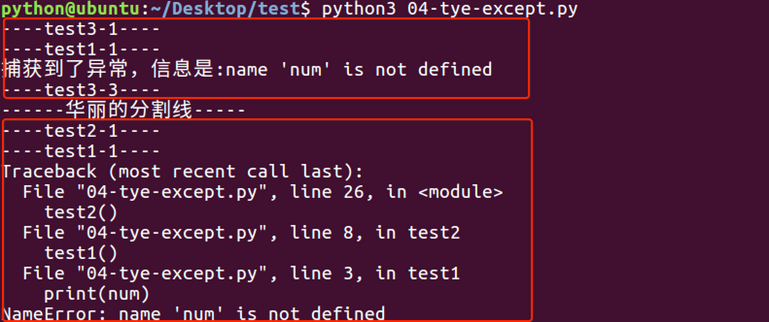

1、捕获异常： try...execpt...     
    
```python
try:
    print(b)
    i = 1/0 #捕获异常后就不再执行这行代码
except NameError:
    print("出现名字异常") #捕获了这种异常就直接执行这行代码
#出现名字异常
```

    * 捕获多种异常，以及打印异常对象
    
```python
try:
    b=1
    print(b)
    i = 1/0
    print("hello")
except (NameError, ZeroDivisionError) as ex:#ex表示刚刚捕获的异常对象
    print("出现异常")
    print(ex) #打印异常信息(即可以记录日志)
    
'''
1
出现异常
division by zero
'''
```

    * 捕获所有的异常使用Exception
 
```python
try:
    b=1
    print(b)
    i = 1/0
    print("hello")
except Exception as result:#ex表示刚刚捕获的异常对象
    print("出现异常")
    print(result)
```

    * else
    
    在try...except...中，即如果没有捕获到异常，那么就执行else中的事情
    
```python

try:
    num = 100
    print (num)
except NameError as errorMsg:
    print('产生错误了:%s'%errorMsg)
else:
    print('没有捕获到异常，真高兴')
```

    * 捕获异常出错后，要保证程序继续运行，使用finally
    
    在程序中，如果一个段代码必须要执行，即无论异常是否产生都要执行，那么此时就需要使用finally。 
    比如文件关闭，释放锁，把数据库连接返还给连接池等
    
```python
import time
try:
    f = open('test.txt')
    try:
        while True:
            content = f.readline()
            if len(content) == 0:
                break
            time.sleep(2)
            print(content)
    except:
        #如果在读取文件的过程中，产生了异常，那么就会捕获到
        #比如 按下了 ctrl+c
        pass
    finally:
        f.close()
        print('关闭文件')
except:
    print("没有这个文件")
```

    

    test.txt文件中每一行数据打印，但是我有意在每打印一行之前用time.sleep方法暂停2秒钟。这样做的原因是让程序运行得慢一些。在程序运行的时候，按Ctrl+c中断（取消）程序。

    我们可以观察到KeyboardInterrupt异常被触发，程序退出。但是在程序退出之前，finally从句仍然被执行，把文件关闭。

2、异常的传递

    try嵌套中的异常传递
    
```python
a = "123"
f = None
try:
    f = open("text.txt")
    try:
        content = f.read()
        content.index("hadoop")
    except Exception as ex:
        print(ex)
    finally:
        print("最里层的finally")
except FileNotFoundError as ex:
    print(ex)
else: #没有异常会自动执行的代码
    print("else")
finally:
    print("finally")
    if f:
        f.close()

'''
如果f = open("text.txt")这行报错，那么就会执行except FileNotFoundError as ex:捕获异常，
然后打印异常信息，最后执行finally:打印finally

里面的try:内容报异常，最后finally都会执行，这跟报异常没有关系；

如果f = open("text.txt")这行报错，它不会进入最里层的finally
'''
```

    *函数嵌套的异常传递
    
```python
    def test1():
        print("----test1-1----")
        print(num)
        print("----test1-2----")


    def test2():
        print("----test2-1----")
        test1()
        print("----test2-2----")


    def test3():
        try:
            print("----test3-1----")
            test1()
            print("----test3-2----")
        except Exception as result:
            print("捕获到了异常，信息是:%s"%result)

        print("----test3-2----")


    test3()
    print("------华丽的分割线-----")
    test2()
```



    注意观察上图中，当调用test3函数时，在test1函数内部产生了异常，
    此异常被传递到test3函数中完成了异常处理，而当异常处理完后，并没有返回到函数test1中进行执行，而是在函数test3中继续执行

3、抛出自定义的异常
    
    可以用raise语句来引发一个异常。异常/错误对象必须有一个名字，且它们应是Error或Exception类的子类
    
```python
class PasswordException(Exception):

    def __init__(self, pw, min_length):
        self.password = pw
        self.min_length =min_length

    def __str__(self):
        return ("%s密码错误，密码的最小长度为%s"%(self.password, self.min_length))

def reg(username, password):
    if len(password) < 6:
        raise PasswordException(password, 6)#抛出你指定的异常
    else:
        print("用户名为%s,密码为%s"%(username, password))

try:
    reg("ja" , "38548")

#两个exception,会按照顺序先执行第一个，如果第一个满足异常条件，就会进入第一个exception,不会进入第二exception
except Exception as ex:
    print(ex)
except PasswordException as ex:
    print("第二个exception")
    print(ex)

```

