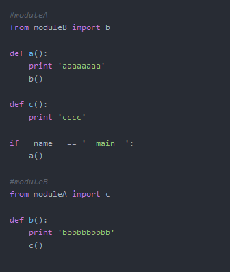
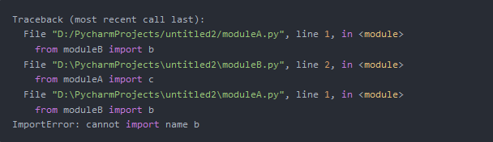
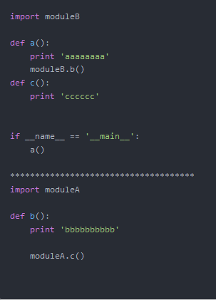
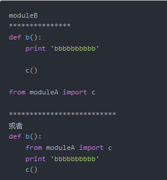

解决循环引用的问题

    当项目中的模块过多，或功能划分不够清晰时会出现循环引用的问题，
    如下有两个模块moduleA 和 moduleB：
    


    这种情况下就会出现以下的错误 ：就是循环引用导致的   
    
    

导入的实质

    导入其实是要将 被导入模块所有的顶格代码都执行一遍，遇到函数和类的定义会作申明。
    如果b模块中有这么一句
    
```python
print("bbb")
```
    你在a模块impot b时就会 执行 print 'bbb'这一句
    
    回到循环引用中，首先导入B,进入B中，发现B中又导入了A又回到A中，但是A又导入B这就形成了循环引用。
    
解法1：直接导入模块名，通过模块调用其中的函数

  

解法2：使用延迟导入(lazy import)
    
    在需要用的函数内部导入，或是在底部导入
    
  

解法3：重新设计代码结构，将代码和并或者分离

    这个要看情况 而定了，将公共功能的代码分离成单独模块，或者将一些具有关系的代码合并成一个模块。

