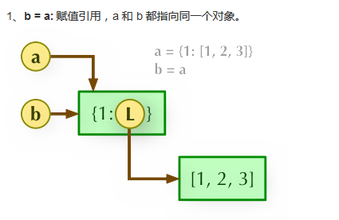
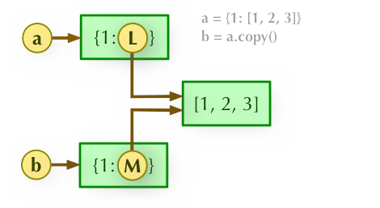
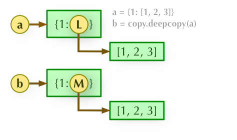

python的直接赋值、浅拷贝以及深拷贝的解析

    * 直接赋值；本质上就是对象的引用
    * 浅拷贝(copy)：拷贝父对象，不会拷贝对象内部的子对象(对于一个对象的顶层拷贝)
        比如一个列表中包含了列表，如果进行了浅拷贝，那么它只是拷贝了外层列表，它的子对象列表还是
        指向了同一个对象(引用),所以对其原来的列表进行添加删除操作，其拷贝的列表对象内容也会随之改变
        
    *深拷贝(deepcopy)：完全拷贝了父对象和子对象(对一个对象所有层次的拷贝即递归)

字典的浅拷贝    
```python
a = {1:[1,2,3]}
b = a.copy()
print(a ,b)

a[1].append(4)
print(a ,b)

''''
{1: [1, 2, 3]} {1: [1, 2, 3]}
{1: [1, 2, 3, 4]} {1: [1, 2, 3, 4]}
'''
``` 

字典的深拷贝

    注意：进行深拷贝时，要导入模块copy
    
```python
import copy
a = {1:[1,2,3]}
b = copy.deepcopy(a)
print(a , b)

a[1].append(10)
print(a , b)

''''
{1: [1, 2, 3]} {1: [1, 2, 3]}
{1: [1, 2, 3, 5]} {1: [1, 2, 3]}
'''
```

解析



2、b = a.copy(): 浅拷贝, a 和 b 是一个独立的对象，但他们的**子对象还是指向统一对象**（是引用）。



b = copy.deepcopy(a): 深度拷贝, a 和 b 完全拷贝了父对象及其子对象，**两者是完全独立的**。



```python
import copy

a = [1, 2, 3, 4, ['a', 'b']]  # 原始对象

b = a  # 赋值，传对象的引用
c = copy.copy(a)  # 对象拷贝，浅拷贝
d = copy.deepcopy(a)  # 对象拷贝，深拷贝

a.append(5)  # 修改对象a 
a[4].append('c')  # 修改对象a中的['a', 'b']数组对象

print('a = ', a)
print('b = ', b)
print('c = ', c)
print('d = ', d)

'''
a =  [1, 2, 3, 4, ['a', 'b', 'c'], 5]
b =  [1, 2, 3, 4, ['a', 'b', 'c'], 5]
c =  [1, 2, 3, 4, ['a', 'b', 'c']]
d =  [1, 2, 3, 4, ['a', 'b']]
'''
```

    总结：在浅拷贝中只拷贝父对象，在深拷贝中所有对象都被拷贝，所以只要被拷贝了就是完全独立的