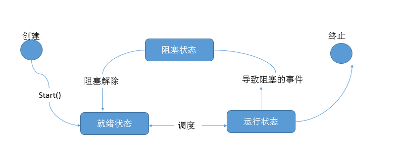

1、多线程概念

    线程：是进程中一个“单一的连续控制流程”执行路径(多线程即可以指定多个执行路径)
    多任务可以由多进程完成，也可以由一个进程内的多线程完成。(线程是进程中的一部分)
    线程可以访问全局变量而进程是不可以的
      
    * 一个程序至少有一个进程，一个进程至少有一个线程。
    
    * 线程是进程的一个实体，是CPU调度和分派的基本单位，它是比进程更小的能独立运行的基本单位
    
2、进程与线程的区别

                         进程                                     线程
    a  根本区别:  作为资源分配的单位                        调度和执行的单位
    
                  每个进程都有独立的代码     线程是轻量级的进程，同一类线程共享代码和数据空间
    b     开销:   和数据空间，进程间的切     每个线程有独立的运行栈和程序计数(PC)，线程切换的
                  换有较大开销               开销小
                  
    c  所处环境:  在操作系统中能同时运行     在同一应用程序中有多个顺序流同时执行
                  多个任务
                  
                  系统在运行时会为每个进     除了CPU之外，不会为线程分配内存(线程所使用的资源
    d  分配内存:  程分配不同的内存区域       所属的进程资源)，线程只能共享资源  
    
                  没有线程的进程是可以被     线程是进程的一部分，所以线程有的时候被称为轻量级
    e  包含关系:  看做单线程的，如果一个     或轻权级进程。
                  进程内有多个线程，则共
                  同完成
                  
3、创建线程

    Python的标准库提供了两个模块：_thread和threading，_thread是低级模块，threading是高级模块，
    对_thread进行了封装。绝大多数情况下，我们只需要使用threading这个高级模块。
    
```python
import threading
import time

#线程中要执行的内容
def sayHello():
    print("Hello Tom!")
    time.sleep(1)

if __name__ == "__main__":
    for i in range(4):
        t = threading.Thread(target=sayHello)
        t.start()#启动线程
        
'''
Hello Tom!
Hello Tom!
Hello Tom!
Hello Tom!
'''
```

4、查看线程数量

    下面的程序中线程是交错执行的

```python
import threading
from time import sleep,ctime

def sing():
    for i in range(3):
        print("正在唱歌%s"%i)
        sleep(1)

def dance():
    for i in range(3):
        print("正在跳舞%s"%i)
        sleep(1)

if __name__ == "__main__":
    print("--开始--:%s"%ctime())
    #创建两个线程
    t1 = threading.Thread(target=sing)
    t2 = threading.Thread(target=dance)
    t1.start()
    t2.start()

while True:
    #把当前所有线程都枚举出来，即获取线程数量
    length = len(threading.enumerate())
    print("当前运行的线程数为：%s"%length)
    #一个进程至少要有一个线程，不能出现等于0的情况
    if length <= 1:
        break
    sleep(0.5)
    
'''
--开始--:Sat Nov  3 08:56:18 2018
正在唱歌0
正在跳舞0
当前运行的线程数为：3
当前运行的线程数为：3
正在唱歌1
正在跳舞1
当前运行的线程数为：3
当前运行的线程数为：3
正在唱歌2
正在跳舞2
当前运行的线程数为：3
当前运行的线程数为：3
当前运行的线程数为：1
'''
```

5、线程的子类化

    使用threading模块时，往往会定义一个新的子类class,只要继承
    threading.Thread就可以了，然后重写run方法
    
```python
import threading
import time

class MyThread(threading.Thread):
    def run(self):
        for i in range(3):
            time.sleep(1)
            #name属性中保存的是当前线程
            msg = "I'm " + self.name + " @ "  +str(i)
            print(msg)

if __name__ == "__main__":
    t = MyThread()
    t.start()
    
'''
I'm Thread-1 @ 0
I'm Thread-1 @ 1
I'm Thread-1 @ 2
'''
```

6、线程的状态

    多线程程序的执行顺序是不确定的。当执行到sleep语句时，线程被阻塞(Blocked)
    到sleep结束后，线程进入就绪(Runnable)状态，等待调度，而线程调度将自行选
    择一个线程执行，代码中只能保证每个线程都运行完整个run函数，但是线程的启
    动顺序、run函数中每次循环的执行顺序都不能确定
    


    因访问某种资源，但资源还没准备好就会陷入阻塞状态
    
    资源准备好，但也不能马上执行，得先进入就绪状态，线程有优先级的
    
7、线程共享全局变量

    在一个进程内的所有线程共享全局变量，能够在不适用其它方式的前提下
    完成多线程之间的数据共享(这点优势比进程要好)
    
    缺点： 线程是对全局变量随意修改可能造成多线程之间对全局变量的混乱(即线程非安全)
    
```python
from threading import Thread
import time

#搜索变量是先从局部变量开始，然后是闭包，全局变量，内建
g_num = 100 #全局变量
def work1():
    global g_num
    for i in range(3):
        g_num += 1
        print("---in work1, g_num is %s---"%g_num)
        
def work2():
    print("---in work2, g_num is %s---" % g_num)

if __name__ == "__main__":
    print("主线程，g_num =%s"%g_num)
    w1 = Thread(target=work1)
    w1.start()
    time.sleep(2)

    w2 = Thread(target=work2)
    w2.start()
    
'''
主线程，g_num =100
---in work1, g_num is 101---
---in work1, g_num is 102---
---in work1, g_num is 103---
---in work2, g_num is 103---

'''
```  

8、线程使用传参的方式使用全局变量  

```python
from threading import Thread
import time

#搜索变量是先从局部变量开始，然后是闭包，全局变量，内建
g_num = 100 #全局变量
def work1(num):
    global g_num
    for i in range(3):
        num += 1
        print("---in work1, g_num is %s---"%num)

def work2(num):
    #方法中操控的是局部变量，所以结果还是100
    print("---in work2, g_num is %s---" % num)

if __name__ == "__main__":
    print("主线程，g_num =%s"%g_num)
    w1 = Thread(target=work1,args=(g_num,))
    w1.start()
    time.sleep(2)

    w2 = Thread(target=work2,args=(g_num,))
    w2.start()

'''
主线程，g_num =100
---in work1, g_num is 101---
---in work1, g_num is 102---
---in work1, g_num is 103---
---in work2, g_num is 100---
'''
```

    如果全局变量是列表
    
```python
from threading import Thread
import time

#搜索变量是先从局部变量开始，然后是闭包，全局变量，内建
g_num = [11,12,13] #全局变量
def work1(num):
    global g_num
    for i in range(3):
        num.append(44)
        print("---in work1, g_num is %s---"%num)

def work2(num):
    #方法中操控的是局部变量，所以结果还是100
    print("---in work2, g_num is %s---" % num)

if __name__ == "__main__":
    print("主线程，g_num =%s"%g_num)
    w1 = Thread(target=work1,args=(g_num,))
    w1.start()
    time.sleep(2)

    w2 = Thread(target=work2,args=(g_num,))
    w2.start()
    
'''
主线程，g_num =[11, 12, 13]
---in work1, g_num is [11, 12, 13, 44]---
---in work1, g_num is [11, 12, 13, 44, 44]---
---in work1, g_num is [11, 12, 13, 44, 44, 44]---
---in work2, g_num is [11, 12, 13, 44, 44, 44]---
'''
```
    