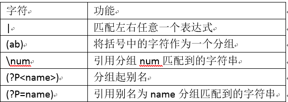

1、正则表达概念

    * 使用单个字符串来描述、匹配一系列匹配某个句法规则的字符串
    
    * 在很多文本编辑器，正则表达式通常被用来检索、替换那些匹配某个模式的文本
    
    * 在开发中会有大量的字符串处理工作，其中经常会涉及到字符串格式的校验，
      比如网页中的注册表单。使用正则表达式会非常方便。
      
        --检测输入的QQ号
        --检测输入的e-mail地址
        --检测输入的手机号
      
2、正则表达式表示字符的规则

    re模块
    * python中需要通过正则表达式对字符串进行匹配的时候，可以使用re模块
        
        # 导入re模块
          import re
        # 使用match方法进行匹配操作
          result = re.match(正则表达式要匹配的字符串)
        # 如果上一步匹配到数据的话，可以使用group方法提取数据
          result.group()
          
re.match 是用来进行正则匹配检查的方法

    若字符串匹配正则表达式，则match返回匹配对象(Match Object),否则返回None(不是空字符串"")
    
    匹配对象Match Object具有group方法，用来返回字符串的匹配部分。
   
注意：match()函数只检测RE是在string的开始位置匹配，也就是说match()只有在0位置匹配成功的话才有返回
    
 

```python
import re
ret = re.match("h","hello python")
print(ret.group())    #h

#大小写都匹配的情况
ret1 = re.match("[hH]","hello python")
print(ret1.group())  #h

#匹配0-9第一种写法
ret2 = re.match("[0123456789]","4hello")
print(ret2.group())   #4

#匹配0-9第二种写法
ret3 = re.match("[0-9]","1hahah")
print(ret3.group())    #1


#匹配任意字符
ret4 = re.match(".","jfdsasf")
print(ret4.group())    #j

#\d表示匹配数字
ret5 = re.match("no.\d","no.1 python")
print(ret5.group())

```

3、原始字符串

    * python中字符串前面加上"r"表示原始字符串
    
    * 正则表达式中使用"\"作为转义字符
        假如你需要匹配文本中的字符"\",那么使用正则表达式里则需要4个反斜杠"\"
        
    * 而python的原始字符串可以有效的解决这个问题
    
```python
import re

path = "c:\\a\\b\\c"
print(path)

ret = re.match("c:\\\\",path)
print(path)
# 上面的表示可以使用原始字符串r,就不用写多于的反斜杠
ret1 = re.match(r"c:\\",path)
print(ret.group())

'''
c:\a\b\c
c:\a\b\c
c:\
'''
```

4、正则表达式表示量词的规则


```python
import re

ret = re.match("\d{11}","18824156412")
print(ret.group())

#一个字符串第一个字母为大小写，后面小写字母可以有0或任意多个
ret1 = re.match("[A-Z][a-z]*","Ddjkd")
print(ret1.group())

#检查变量的有效性：第一个为字母或下划线
ret2 = re.match("[a-zA-Z_]+\w*","name")
print(ret2.group())
#只取出了符合规则的一部分"na"
ret3 = re.match("[a-zA-Z_]+\w*","na%me")
print(ret3.group())

#匹配0-99
ret4 = re.match("[1-9]?[0-9]","09")
print(ret4.group())  #0

ret5 = re.match("[1-9]?[0-9]","99")
print(ret5.group())  

'''
18824156412
Ddjkd
name
na
0
99
'''
```

5、正则表达式边界规则


```python
import re

#匹配0-99，规则中加了$符号，匹配的时候从后面开始匹配所以09就不符合
ret4 = re.match("[1-9]?[0-9]$","09")
print(ret4.group())

'''
AttributeError: 'NoneType' object has no attribute 'group'
'''
```    

```python
import re

# 匹配163.com邮箱地址,用$从后面开始匹配
ret = re.match("[\w]{4,20}@163\.com$","xiaowang@163.com")
print(ret.group())

ret1 = re.match(r".*\bver\b","ho ver abc")
print(ret1.group())
'''
xiaowang@163.com
ho ver
'''
```

6、正则表达式表示分组的规则



"|":匹配左右任意一个表达式

```python
import re

# 匹配分组"|"表示或的意思，匹配163.com邮箱地址,用$从后面开始匹配
ret = re.match("[\w]{4,20}@(163|qq|126)\.com$","xiaowang@163.com")
print(ret.group())

ret1 = re.match("[\w]{4,20}@(163|qq|126)\.com$","xiaowang@qq.com")
print(ret1.group())

ret2 = re.match("[\w]{4,20}@(163|qq|126)\.com$","xiaowang@126.com")
print(ret2.group())
#电话号码开头也可以使用这种方式
'''
xiaowang@163.com
xiaowang@qq.com
xiaowang@126.com
'''
```

[^-] 表示匹配除了"-"之外---引用分组

```python
import re

# 匹配分组"|"表示或的意思，匹配163.com邮箱地址,用$从后面开始匹配
ret = re.match("([^-]*)-(\d+)","010-123456778")
print(ret.group())
# 引用第一个分组，取出对应的值
print(ret.group(1))
'''
010-123456778
010
'''
```

通过引用分组的方式匹配

```python
import re
#这种匹配也能打印结果，但不是正常的标签
ret = re.match("<([a-zA-Z]*)>\w*</([a-zA-Z]*)>","<html>hahaha</body>")
print(ret.group())

#使用引用分组
ret1 = re.match("<([a-zA-Z]*)>\w*</\\1>","<html>hahaha</html>")
print(ret1.group())

ret2 = re.match(r"<([a-zA-Z]*)>\w*</\1>","<html>hahaha</html>")
print(ret2.group())

'''
<html>hahaha</body>
<html>hahaha</html>
<html>hahaha</html>
'''
```

分组命名

```python
import re
#分组命名
ret = re.match(r"<([a-zA-Z])*><(\w*)>\w*</\2></\1>","<html><h1>tilet</h1></html>")
print(ret.group())
```

7、re模块的其它用法

    * search 搜索符合特征的字符串，全局匹配，不同于match
```python
import re

sc = re.search(r"\d+","浏览次数为9999，评论次数为200")
print(sc.group())
#使用match就会报错，因为match需要一开始就匹配
sc = re.match(r"\d+","浏览次数为9999，评论次数为200")
print(sc.group())
'''
9999
AttributeError: 'NoneType' object has no attribute 'group'
'''
```    
    
    * findall 找出所有符合特征的字符串
    
```python
import re

fd = re.findall(r"\d+","浏览次数为9999，评论次数为200")
print(fd)
'''
返回一个列表
['9999', '200']

'''
```    
    * sub 将匹配到的数据进行替换
 
```python
import re

su = re.sub(r"\d+",'999',"评论次数为200")
print(su)
#评论次数为999
```  
    * split 根据匹配进行切割字符串，并返回一个列表
    
```python
import re

#根据冒号或者空格切割
sl = re.split(r":| ","info:xiaoli 33 years old shandong")
print(sl)

'''
返回一个列表
['info', 'xiaoli', '33', 'years', 'old', 'shandong']
'''
```

8、贪婪模式和非贪婪模式

    * python的正则表达式默认是贪婪的(在少数语言里也默认贪婪的)，总尝试匹配更多的字符
    
    * 非贪婪则相反，总是尝试匹配尽可能少的字符
    
    * 在“*”，“？”，“+”，“{m,n}”后面加上?，使贪婪变成非贪婪
    
```python
import re
ret = re.match(r"aa(\d+)","aa223344ddd").group()
print(ret)
#在"+"后面添加"?"
ret1 = re.match(r"aa(\d+?)","aa223344ddd").group()
print(ret1)

#贪婪模式不起作用
ret2 = re.match(r"aa(\d+?)ddd","aa223344ddd").group()
print(ret2)

'''
aa223344
aa2
aa223344ddd
'''
```

