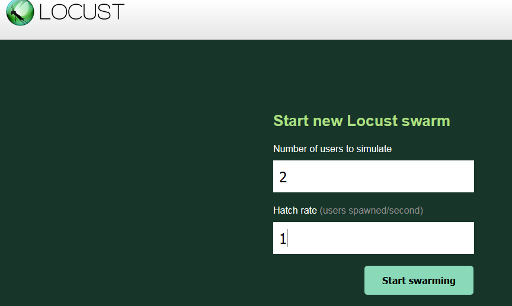
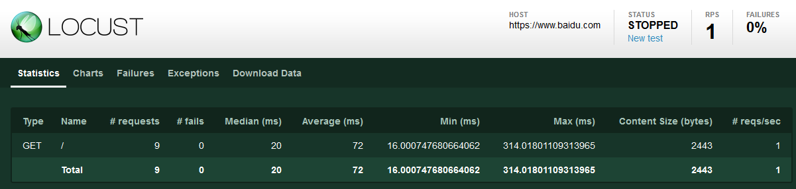

Locust 安装
    
    cmd命令窗口下输入命令：pip3 install locustio
    
    Locust是使用Python开发的支持分布式的一款开源压力测试工具，Locust在测试时，
    会产生大量的用户对系统进行访问，每个用户的行为是通过Python代码控制的，并且整个测试过程可以在Web的UI界面实时观察测试数据。
    
    Locust在单台机器上能够支持几千并发用户访问，Locust内部采用了协程gevent，通过采用分布式的方式,理论上Locust工具能够模拟无数的用户。
    
验证是否安装成功
    
    locust --help
    
建立一个test01_locust.py测试脚本

```python
from locust import HttpLocust, TaskSet,task

class UserBehavior(TaskSet):
    @task  #事务
    def bai_page(self):
        self.client.get("/")

class User(HttpLocust):
    task_set = UserBehavior
    min_wait = 1000
    max_wait = 3000
```

    在这个示例中，定义了针对https://www.baidu.com网站的测试场景：
    访问首页（/）并且，在测试过程中，min_wait,max_wait指定用户事
    务之间用户暂停的时间1—3秒，接近真实操作。

在对应目录中执行性能测试命令

    >locust -f test01_locust.py --host=https://www.baidu.com
    
    通过浏览器访问:http://127.0.0.1:8089（localhost:8089）
    




Locust类中的常用属性

    * client属性：它对应着虚拟用户作为客户端所具备的请求能力，也就是我们常说的请求方法。
    
    * task_set: 指向一个TaskSet类，用于描述用户行为，该属性为必填；
    
    * max_wait/min_wait: 每个用户执行两个任务间隔时间的上下限（毫秒），具体数值在上下限中
                         随机取值，若不指定则默认间隔时间固定为1秒；
    
    * host: 被测系统的host，当在终端中启动locust时没有指定--host参数时才会用到；
    
    * weight：同时运行多个Locust类时会用到，用于控制不同类型任务的执行权重。                     

TaskSet类

    TaskSet类实现了虚拟用户所执行任务的调度算法
    * schedule_task；规划任务执行顺序
    * execute_next_task：挑选下一个任务
    * execute_task：执行任务
    * wait；休眠等待
    * interrupt：中断等待
    
在TaskSet子类中定义任务信息时，可以采取两种方式，@task装饰器和tasks属性。

    采用@task装饰器定义任务信息时，描述形式如下：
    
```python
from locust import TaskSet,task

class UserBehavior(TaskSet):
    @task(1)
    def test_locust1(self):
        self.client.get('/boss1')

    @task(2)
    def test_locust2(self):
        self.client.get('/boss2')
```  

采用tasks属性定义任务信息时，描述形式如下：

```python
from locust import TaskSet

def test_locust1(self):
    self.client.get('/boss1')

def test_locust2(self):
    self.client.get('/boss2')

class UserBehavior(TaskSet):
    tasks = {test_locust1:1,test_locust2:2}
    #tasks = [(test_locust1:1),(test_locust2:2)]
```

    在如上两种定义任务信息的方式中，均设置了权重属性，即执行test_job2的频率是test_job1的两倍。                       
    若不指定执行任务的权重，则相当于比例为1:1。
    
在TaskSet的on_start函数

    这个和LoadRunner中的vuser_init功能相同，在正式执行测试前执行一次，主要用于完成一些初始化的工作。
    例如，当测试某个搜索功能，而该搜索功能又要求必须为登录态的时候，就可以先在on_start中进行登录操作；
    前面也提到，HttpLocust使用到了requests.Session，因此后续所有任务执行过程中就都具有登录态了。
    
